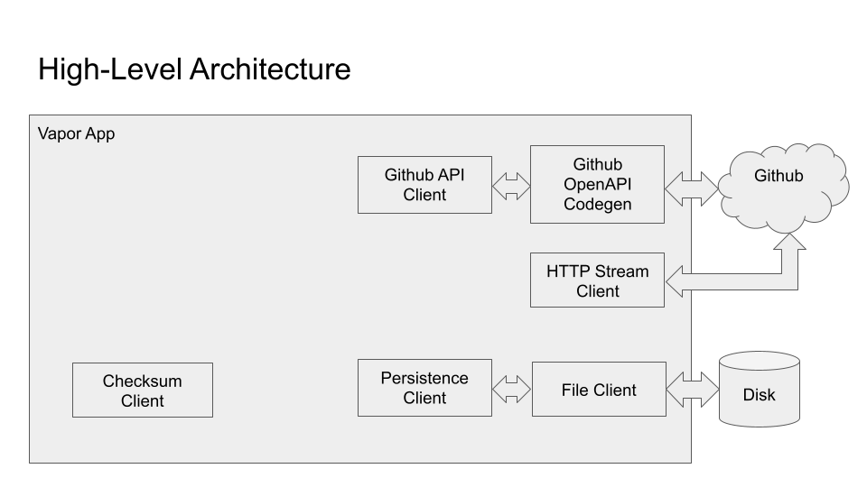

# Architecture

This article describes the architecture of the Swift Package Registry Service.

## Architecture Diagram

Visually, the architecture can be described as:



Each of the components above are the following:

* Checksum Client. This can be found in the `ChecksumClient` module, and is an abstraction of a SHA256 checksum.
* GithubAPIClient. This is an abstraction of the minimal set of Github API endpoints that we need. The public
  API can be found in the `GithubAPIClient` module, and the implementation can be found in the `GithubAPIClientImpl` module.
* Github OpenAPI Codegen. This can be found in the `GithubOpenAPI` module. It uses the [swift-openapi-generator](https://github.com/apple/swift-openapi-generator)
  Swift Package Manager plugin to generate code from the Github API.
* HTTP Stream Client. This can be found in the `HTTPStreamClient` module, and is an abstraction of an HTTP client.
* Persistence Client. This is a client for reading and writing cached data to/from the disk. It can
  be found in the `PersistenceClient` module.
* File Client. This is an abstraction for a file system, and can be found in the `FileClient` module.

For all of our clients, we use the [swift-dependencies](https://github.com/pointfreeco/swift-dependencies) style of clients.

## Swift Package Registry Service endpoints

As described [here](https://github.com/swiftlang/swift-package-manager/blob/main/Documentation/PackageRegistry/Registry.md#4-endpoints),
a Swift Package Registry Service must implement 6 endpoints:

1. List Package Releases (`GET /{scope}/{name}`)
2. Fetch Release Metadata (`GET /{scope}/{name}/{version}`)
3. Fetch Manifest (`GET /{scope}/{name}/{version}/Package.swift`)
4. Download Source Archive (`GET /{scope}/{name}/{version}.zip`)
5. Lookup Package Identifiers (`GET /identifiers?url=`)
6. Create Package Release (`PUT /{scope}/{name}/{version}`)

However, the Create Package Release endpoint is optional. From the spec:

```
Support for this endpoint is OPTIONAL. A server SHOULD indicate that publishing isn't supported by responding with a status code of 405 (Method Not Allowed).
```

Since we are only interested in our service being a read-only service, then we do not support publishing, and thus the Create Package Release
endpoint always returns `405 Method Not Allowed`.

The sections which follow provide more detail into the implementation of each of the endpoints.

## List Package Releases implementation

The List Packages Releases (`GET /{scope}/{name}`) endpoint is implemented as follows:

1. Do checks to validate the input parameters (package scope, package name, and Accept header).
2. Check the memory cache for tag information for this package:
   - If there is cached tag information and it is less than 5 minutes old, then use it to construct the response.
   - Otherwise, we proceed to step 3 to refresh the memory-cached tag information.
3. Attempt to read the cached tag information from the disk cache. If the age
   of the disk-cached tag information is less than 30 minutes old, then use to to construct
   the response. Otherwise, proceed to step 4 to refresh the disk-cached tag information.
4. If we have at least one tag in the disk-cache, then call the Github API
   [List Repository Tags](https://docs.github.com/en/rest/repos/repos?apiVersion=2022-11-28#list-repository-tags)
   endpoint to fetch the latest tag. If the latest tag was present in the disk cache,
   then we know the disk cache is up-to-date and we use the tag information
   in the disk cache to construct the response. Otherwise, we proceed to step 5.
5. Next, using the same 
   [List Repository Tags](https://docs.github.com/en/rest/repos/repos?apiVersion=2022-11-28#list-repository-tags)
   endpoint, we fetch all of the tags for this repository, one page at a time.
6. Next we compute the mapping from semantic version to tags.
7. Next we write out the list of tags and the version-to-tag mapping to disk cache.
8. Then we return the list of semantic versions in the response.

## Fetch Release Metadata Implementation

There is currently no API in the Github API to return the SHA256 checksum
of a source archive. Some developers have written Github Actions like [this](https://github.com/marketplace/actions/sha256-checksum)
or [this](https://github.com/jmgilman/actions-generate-checksum). So therefore,
since the source archive checksum is part of the Release Metadata information,
then we have to download the source archive and computes its checksum before
responding.

The Fetch Release Metadata (`GET /{scope}/{name}/{version}`) endpoint is implemented as follows:

1. Do checks to validate the input parameters (package scope, package name, package version,
   and Accept header).
2. Check the memory cache for release metadata for this package. If it is present,
   then use it to construct the response. Otherwise, go to step 3.
3. Check the disk cache for release metadata for this package. If it is present,
   then use it to constrct the response. Otherwise, go to step 4.
4. Do steps 2-8 from the List Package Releases to fetch the tag information for this respository.
5. Find the tag which corresponds to the input semantic version.
6. Call the [Get A Release By Tag Name](https://docs.github.com/en/rest/releases/releases?apiVersion=2022-11-28#get-a-release-by-tag-name)
   Github API endpoint to find the `publishedAt` date for this tag. It is not an error
   if no release is associated with that tag. In that case, we simply don't provide
   a `publishedAt` `Date` in the response.
7. Next we download the source archive for this tag to disk.
8. Next we compute the SHA256 checksum for this source archive.
9. Next we save the version and its associated tag, the SHA256 checksum, and the `publishedAt` date
   to the disk cache.
10. Then we return this same information and construct the response.


## Fetch Manifest Implementation

The Fetch Manifest (`GET /{scope}/{name}/{version}/Package?swift-version=`) endpoint
is implemented as follows:

1. Do checks to validate the input parameters (package scope, package name, package version,
   and Accept Header).
2. Check the memory cache for manifest information for this package version. If it is present,
   then skip to step 11 to return the response.
3. Check the disk cache for manifest information for this package version. If it is present,
   then skip to step 11 to return the response.
4. Do steps 2-8 from the List Package Releases to fetch the tag information for this respository.
5. Look up the tag for the input semantic version.
6. Use the
   [Get Repository Content](https://docs.github.com/en/rest/repos/contents?apiVersion=2022-11-28#get-repository-content)
   Github API endpoint to fetch the directory contents of the root of the repository.
7. Look through the filenames of the files in the respository root to find all of
   the package manifests. If we don't find any, then return a 404 Not Found.
8. Use the same
   [Get Repository Content](https://docs.github.com/en/rest/repos/contents?apiVersion=2022-11-28#get-repository-content)
   Github API endpoint to fetch each of the package manifests found in step 7.
9. For each of the manifests, parse out the `swift-tools-version` found at the top
   of each manifest.
10. Save each of the manifests to disk cache, and save the list of manifests (along with
    their `swift-tools-version`) to disk.
11. If had a `swift-version` query parameter in the request, then find the
    corresponding package manifest in the manifest information, and return that
    manifest. If there was no swift-version-specific package manifest corresponding
    to the specified `swift-version`, then return a 303 See Other response,
    with the Location header pointing to the un-versioned package manifest.
12. If we did not have a `swift-version` query parameter in the request,
    then look up the un-versioned package manifest in the manifest information,
    and return it. Include any information about the other swift-version-specific 
    manifests in the Link header.


## Download Source Archive Implementation

The Download Source Archive (`GET /{scope}/{name}/{version}.zip`) endpoint is implemented
as follows:

1. Do checks to validate the input parameters (package scope, package name, package version,
   Accept header).
2. Do steps 2-10 in the Fetch Release Metadata implementation to fetch
   release metadata. This will also result in the source archive for the specified
   version being downloaded.
3. Read the source archive from disk and return it in the response.

## Lookup Package Identifiers Implementation

The Lookup Package Identifiers (`GET /identifiers?url=`) endpoint is implemented
as follows:

1. Do checks to validate the input parameters (`url` query parameter and Accept header)
2. Parse the input `url` query parameter. It must be in one of the following three forms.
   If it is not, then return a 404 Not Found.
   - An "HTML URL" of the form `https://github.com/<scope>/<name>`
   - A "Clone URL" of the form `https://github.com/<scope>/<name>.git`
   - An "SSH URL" of the form `git@github.com:<scope>/<name>.git`
3. Check the memory cache for a package ID for this URL. If it is present,
   then return it in the response. Otherwise, go to step 4.
4. Check the database for a cached Repository which has a clone URL, HTML URL, or SSH URL
   equal to the input URL. If we find it, then return the package ID of this repository.
   Otherwise, go to step 5.
5. Call the
   [Get Repository](https://docs.github.com/en/rest/repos/repos?apiVersion=2022-11-28#get-a-repository)
   Github API endpoint to fetch information for this repository. If this API call
   returns 404 Not Found, then we also return 404 Not Found. Otherwise, go to step 6.
6. Save the Repository information returned by the Github API to the database.
7. Return the package ID of the Repository returned by the Gitub API.
